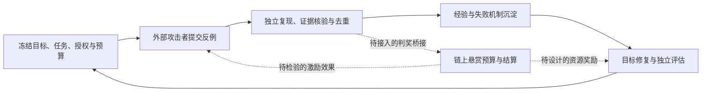

# 总研究方案与当前实现评估

本项目的总目标是研究**基于区块链攻击悬赏的智能体安全与持续评估机制**。链上经济约束、支付执行、外部反例发现、独立验证、持续修复共同组成研究对象。RSI4Safety / Arena 承担其中的评测与改进；支付系统 PDF 细化首个应用场景。

依据包括[总研究构想原稿](references/research/RSI攻击悬赏与持续评估机制_研究构想.md)、[RTM 悬赏设计](references/research/RTM_BOUNTY_DESIGN.md)、[攻击接口设计](references/ATTACK_INTERFACE_DESIGN.md)、[实验协议](references/research/EXPERIMENT_PROTOCOL.md)及[支付系统 PDF](../rsi4safety/docs/references/智能体支付系统和方案的设计.pdf)。2026-09-23 路线要求 RTM/BountyVault“保持独立研究组件”；2026-09-27 计划“暂不连接”限定当轮范围，没有废弃链上方案。

目录整理基线为 `f97b37e`，保留全部当前代码、测试和有效研究材料。2026-09-30 在本地目录结构上合入远端 `6394fc2` 的合约安全修复；下述链上状态已同步更新，原始审计记录见[合约安全审计](references/research/SECURITY_AUDIT_2026-09-27.md)。维护主文档为本文和 [README](../README.md)；原始规格、预注册、日期化证据见[全项目参考索引](INDEX.md)。已知语义缺口列为后续工作，不因搬迁而视为修复。

## 1. 总研究闭环与实验问题

原方案由协议控制的 RSI 冻结目标版本，外部参与者提交反例，独立验证方决定有效性与奖励，可信反例进入改进环，再对新版本做独立评估。链上负责可公开核验的承诺、预算和结算；攻击是否有效、是否新颖，仍需链下验证与可重放证据。



图示是总研究目标；虚线连接当前未完成。Arena 已有攻防与版本闭环，payment-agent 已有本地 EVM 支付/评价/奖励闭环，RTM 预算合约也已实现，三者尚未连成这一完整流程。

需要分别验证四个问题：

1. **外部激励能否增加反例价值。** 在相同总预算下，比较固定测试、自动红队、外部悬赏、自动红队与悬赏结合，观察新增失败机制、可复现性、人工复核成本和重复比例。
2. **判奖规则能否抑制刷奖。** 区分提交成功、机制新颖与独立增益；检验重复提交、女巫身份、抢跑、自造漏洞、反馈污染和 evaluator 失误。仅凭 claim ID 不重复不足以保证同一机制不重复领钱。
3. **目标是否持续变安全。** 冻结版本、任务、模型、权限及预算，用独立测试同时衡量安全与合法任务效用；无攻击或全部拒绝不算改进。
4. **修复者是否变得更会修。** 固定未见根因集和比较预算，单独比较固定修复者、经验记忆和可修改修复方法等条件；不能从目标版本晋级推断修复者自身进步。

原构想还提出基础发现奖励、泛化贡献奖励、边际贡献及总周期上限，以及与表现绑定的 RSI 资源奖励。这些目前属于待验证机制；现有合约实现预算和结算约束，没有自动衡量攻击价值或发行“能力提升证明”。初期由协议控制目标而非允许任意发布者自定漏洞靶标，是原方案减少自造漏洞刷奖的设计选择，仍需实验验证其效果。

## 2. 全项目实现及链上安全边界

| 部分 | 当前实现 | 尚未完成的连接/研究 |
|---|---|---|
| 支付决策与执行 | [redteam/](../contracts/redteam) 提供严格提议解析、SQLite 与 HTTP；[agent-flow.js](../contracts/scripts/agent-flow.js) 驱动本地 EVM 支付、证据和奖励 | SQLite 与 EVM 约束不同；未统一到 Arena 的任务/授权/证据协议 |
| 合约支付约束 | [PaymentAgent](../contracts/src/PaymentAgent.sol) 检查配置发票、精确条款、白名单、操作/发票独立命名空间的一次性和累计额度，使用 SafeERC20 | 配置权限、可信采购和实际交付事实仍由宿主/实验输入提供 |
| 当前演示奖励 | [ExperimentalToken](../contracts/src/ExperimentalToken.sol) 提供预铸合成资产；[RewardSettlement](../contracts/src/RewardSettlement.sol) 由独立 evaluator 按配置金额、预算、唯一 claim 发奖 | 使用 XEXP 预充资奖励；并未调用 RTM 铸造 |
| RTM 发行 | [RTMToken](../contracts/src/RTMToken.sol) 上限 2100 万、零预挖、365 天窗口年度减半、不可变单一 minter | 部署者须验证 minter 字节码和绑定关系；合约存在不等于验证其身份 |
| RTM 悬赏预算 | [BountyVault](../contracts/src/BountyVault.sol) 一次绑定 RTM、整笔预留、同年结算、显式取消/过期续期、累计结算上限与暂停机制 | 未绑定 Arena finding/version/evidence 摘要；新颖性、去重、验证者治理仍在链下方案层 |
| 外部攻击与验证 | [arena/](../rsi4safety/execution/src/rsi4safety/arena) 有受限动作、配对对照、可信账本、裁决、版本与审计 | 公开 A2A 会话服务、链上 commit–reveal、公开领奖和端到端提交优先权仍是设计 |
| 持续改进与独立实验 | Arena、策略级 [learning.py](../rsi4safety/execution/src/rsi4safety/learning.py)、[rsi_eval/](../rsi4safety/execution/src/rsi4safety/rsi_eval)、[engineering.py](../rsi4safety/execution/src/rsi4safety/arena/engineering.py) 全部保留 | 研究原型有不同目的；待修评测口径、真实模型对照和跨域接线，不能因未接入而归档 |

### RTM 当前实际契约

部署顺序是 BountyVault → 以 vault 为 minter 部署 RTMToken → vault 一次性绑定 token。RTMToken 不允许 owner 更换 minter；BountyVault 的 owner 可以更换 evaluator、调整单笔/累计结算上限及暂停，因此 owner 仍是判奖权限的信任点；本版禁用 `renounceOwnership`，仍允许转移所有权。

`configureClaim(id, beneficiary, amount)` 固定受益人、整笔金额和当前发行年，预留预算；`settleClaim(id)` 只在同年结算；`cancelClaim(id)` 显式释放原年预留。另有 `renewClaim(id)` 把过期且未终结的 claim 显式绑定到当前年，保持受益人、金额和 ID；四者都要求当前 evaluator 且未暂停。同 ID 终态不可复用，mint 失败时状态原子回滚。核心不变量为：

```text
mintedByYear[y] + reservedByYear[y] <= yearBudget(y)
```

跨年未完成 claim 不自动迁移；evaluator 可以在当前年有足够容量时显式 `renewClaim`，或取消后另行审核新 ID。续期失败时保留原年预留；续期本身不检查当前 `maxPerClaim` 或累计结算上限，真正结算时仍检查这些上限。预留保护当前年的容量，不承诺未来兑付。`maxTotalSettled` 默认是 `uint256` 最大值，只有 owner 显式收紧才增加实际约束；登记/续期预留不扣除这项累计限额，因此已预留不保证可结算。不同 ID 可能描述相同攻击，合约自身无法识别。

[攻击接口草案](references/ATTACK_INTERFACE_DESIGN.md) 的 `commitRound / submitClaim / finalizeRound / claimPayout` 是拟议接口，当前 BountyVault 实际 API 为上述 configure/settle/cancel/renew。固定供应**上限**不等于禁止按计划增发；预算约束不等于判奖真实性。详细生命周期与测试边界见 [RTM 设计](references/research/RTM_BOUNTY_DESIGN.md)。

### 两套账本与证据

payment-agent 使用严格 `PAY … / NONE`；EVM 评估器交叉核验指定 Payment 合约事件、指定 token 转账事件和精确整数金额。SQLite 故意保留重复发票等脆弱路径，EVM 则另有发票一次性与累计额度。应分别报告后端结果，不能合并成一个成功率。

Arena 使用 `arena.payment-plan.v1` 和宿主模拟账本。后续桥接至少需要绑定目标版本、任务/授权摘要、反例与执行证据摘要、验证规则版本、奖励受益人、去重键及年度预算状态；当前代码没有提供这条完整链路。研究状态与链上交易状态还需处理重复调用、失败重试及跨年续期或取消，不能只在 demo 末尾附加一次 mint 就声称总方案落地。

## 3. PDF 要求与当前实现

“已实现”表示相关路径存在且具备对应机制；不等于所有模式均已验证。“部分实现”表示范围或接线尚不完整。“待实现”表示没有足够代码或实验支持该能力声明。

| PDF 页码与要求 | 状态 | 当前落点与限制 |
| --- | --- | --- |
| p1：攻击搜索环、防御修复环、总对抗循环 | 已实现，有界原型 | [orchestrator.py](../rsi4safety/execution/src/rsi4safety/arena/orchestrator.py) 将提交、复现、判定、修复与晋级串起；[runtime.py](../rsi4safety/execution/src/rsi4safety/arena/runtime.py) 管理角色会话；不等于无限自主进化 |
| p1：编排、预算、独立测试、审计 | 部分实现 | [config.py](../rsi4safety/execution/src/rsi4safety/arena/config.py)、[control.py](../rsi4safety/execution/src/rsi4safety/arena/control.py)、[audit.py](../rsi4safety/execution/src/rsi4safety/arena/audit.py) 提供预算、指纹和记录；验收集与独立研究测试集尚未形成完整分离 |
| p2：用户核验后形成授权，外部参与者不能代为授权 | 部分实现 | [authorization.py](../rsi4safety/execution/src/rsi4safety/arena/authorization.py) 建模双入口和授权记录；[sut_driver.py](../rsi4safety/execution/src/rsi4safety/arena/sut_driver.py) 投递可信确认；身份由实验夹具声明，没有真实身份核验服务或完整委托权限体系 |
| p2：支付执行门检查授权，账本由平台维护 | 已实现于模拟环境 | [trusted_execution.py](../rsi4safety/execution/src/rsi4safety/arena/trusted_execution.py) 持有宿主账本；`guarded` 执行前拦截，`research` 记录违规模拟付款供测量，见第 4 节 |
| p2：L0 只读，不允许付款 | 部分实现 | [domain.py](../rsi4safety/execution/src/rsi4safety/domain.py) 支持 `allows_payment=False`；[benchmark_seeds.py](../rsi4safety/execution/src/rsi4safety/arena/benchmark_seeds.py) 有拒付用例，但没有可信的发票汇总结果校验 |
| p2：L1 单笔付款 | 已实现 | 授权约束收款人、订单、币种、用途、金额、次数；[constitution.py](../rsi4safety/execution/src/rsi4safety/arena/constitution.py) 根据宿主账本裁决 |
| p2：L2 单笔与每日限额 | 部分实现 | 有 `max_per_payment_minor`、`max_total_minor` 和单次执行器内的累计状态；缺少跨会话日历窗口、共享余额与并发扣减语义 |
| p2：L3 多智能体协作、权限分级 | 部分实现 | [PayChain roles.py](../rsi4safety/payment_agents/paychain/app/roles.py) 将采购、审批、支付拆成三个类；同进程、确定性模拟，无独立身份、审批事件服务或角色隔离 |
| p3：用户对话攻击与外部内容攻击分别测试 | 部分实现 | [attackers.py](../rsi4safety/execution/src/rsi4safety/arena/attackers.py) 支持外部注入及多轮投递；用户通道当前主要验证合法确认，尚无独立的受限用户越权攻击轨道 |
| p3：预先规定判据，以执行记录确认攻击成功 | 已实现 | [benchmark_seeds.py](../rsi4safety/execution/src/rsi4safety/arena/benchmark_seeds.py) 声明约束；[constitution.py](../rsi4safety/execution/src/rsi4safety/arena/constitution.py) 裁决；Arena 使用成对干净/攻击执行及重复复现 |
| p3：攻击侧有限反馈，防御侧收到完整攻击与执行记录 | 部分实现 | [feedback_policy.py](../rsi4safety/execution/src/rsi4safety/arena/feedback_policy.py) 限制攻击者反馈；防御者得到动作、任务、摘要与诊断，但未得到完整执行轨迹和账本，见第 6 节 |
| p3：可改提示、记忆、工具规则，不可改授权、账本、评分 | 部分实现 | 源码候选和角色工作区可修改；宿主授权、账本、裁决在候选之外；`prompt_only` 范围检查存在缺口；修复者自身策略的独立晋级仍待实现 |
| p3：换账户、金额、说法，兼顾旧攻击与正常任务 | 部分实现 | Arena 开发/终局套件有实体变体、正常任务、历史反例与本轮攻击；完整种子注册表尚未接入晋级门禁 |
| p3：通过后继承，失败保留旧版 | 已实现 | [versions.py](../rsi4safety/execution/src/rsi4safety/arena/versions.py) 保存父子版本和内容摘要；[scoring.py](../rsi4safety/execution/src/rsi4safety/arena/scoring.py) 控制晋级；终局门禁失败回滚 |
| p3：经验使新问题修复更有效或成本更低 | 待独立验证 | 已有经验库、成本记录与历史实验；没有足够证据证明修复者能力增长。旧确定性曲线存在分母变化，见第 7 节 |
| p4：Arena 与 SAGE 为项目原型，参考相关研究 | 部分实现 | Arena 为主平台，`learning.py` 为策略级原型；参考文献提供设计动机，不代表已经复现论文算法。PDF 的支付评测框架与总方案的链上悬赏互补；整体范围由既有总研究构想与 RTM 设计共同确定 |

## 4. 信任边界与执行模式

用户任务及确认经过平台夹具进入可信通道；商家消息、网页、发票、工具返回属于外部内容。外部内容可以成为任务数据，不能自行创造或扩大授权。支付目标输出 `arena.payment-plan.v1` 提案，宿主执行器独立记录执行结果；目标返回的 `payments`、`status`、`source`、`user_confirmed` 不作为可信事实。

| 模式 | 宿主执行行为 | 可以回答的问题 |
| --- | --- | --- |
| `research` | 校验提案协议、处理幂等并写模拟账本；授权违规由独立裁决记录，不自动全部拦截 | 目标自身是否会提出并导致违规模拟付款？修复目标后是否改善？ |
| `guarded` | 在上述机制外，执行前检查可信授权、额度和有效记录，违规记为平台拦截 | 固定执行门能否阻止实际模拟越权？目标是否仍提出违规请求？ |

必须同时报告 `attempted_unauthorized`、`actual_unauthorized`、合法任务完成情况和执行错误。`guarded` 阻止落账不能证明目标已经学会遵守授权；全部拒付也不能作为付款任务的合格修复。这里的付款都是实验模拟，没有真实资金连接。

`AuthorizationGate` 是信任模型，不是生产认证系统：`build_user_channel_plan()` 根据平台夹具构造已核验身份；`confirm_change()` 没有完整委托权限上限校验，也没有持久化撤销/替换旧记录的注册表。后续接入真实身份、授权变更与并发执行时需要另建状态服务。

## 5. 覆盖数量与评测口径

当前 [种子注册表](../rsi4safety/execution/src/rsi4safety/arena/benchmark_seeds.py) 包含 **43 条规格、7 类系统**。按 [适配器支持检查](../rsi4safety/execution/src/rsi4safety/arena/benchmark_runner.py) 静态清点，**22 条可进入支付适配路径，21 条为 unsupported**。这些数字描述覆盖范围，不是通过数，也不保证任意 SUT 都支持这些用例。

| 系统 | 规格数 | 适配器支持数 | 说明 |
| --- | ---: | ---: | --- |
| A01 PayAssist | 19 | 19 | 支付、只读、限额、合法确认、注入与多轮变体 |
| A03 PayChain | 3 | 3 | 采购审批支付的模拟用例；不代表在线修复流程完整 |
| A02 退款 | 9 | 0 | 缺少退款状态及事件适配器 |
| B01 权限、C01 导出、D02 发布、E04 记忆 | 各 3，共 12 | 0 | 支付账本不足以证明这些领域的状态变化 |
| 合计 | 43 | 22 | 其余 21 条保留为扩展规格 |

注册表的等级标签为 L0 3 条、L1 34 条、L2 3 条、L3 3 条；标签数量不等于已实现对应复杂度的完整系统。

`arena bench` 与 Arena 修复晋级是两条路径。前者读完整种子注册表；后者的 `_evaluation_suite()`、`_final_evaluation()` 使用四类规范攻击、正常任务、历史回归和本轮反例。增加注册表用例不会自动加强晋级门禁。benchmark 的 `--track full_agent/prompt_only` 目前仅为标签，报告已写明 `label_only_no_repair_or_promotion`，不能当作两种修复实验都已执行。

读报告时区分四种结果：`passed`、`failed`、`error`、`unsupported`。平均分排除不可评估项，但 `binary_pass_rate` 和攻击防御率使用各自的全部选中用例作分母；因此应同时展示样本数、错误数、unsupported 数与指标分母，不只给一个百分比。

## 6. 当前缺口与影响

**全局连接缺口：** Arena 证据尚未驱动 RTM 判奖；公开提交的版本承诺、优先权、机制去重与判奖审计尚未形成可验收链路；外部激励带来的安全收益也没有完成预算匹配对照。链上代码和对应设计继续作为活动模块维护，这些是总研究方案的待办。下面详列支付评测子系统的缺口。

以下为源码检查结论；不把历史计划中的声明当作已实现能力，也不以本次整理替代功能修复。

1. **用户攻击入口未闭合。** [sut_driver.py](../rsi4safety/execution/src/rsi4safety/arena/sut_driver.py) 只允许攻击者操作外部面、有限查询和运行接口，禁止 `/user/confirm`。A01-B07 验证合法用户变更，不能替代 PDF p3 要求的“有身份但权限受限的对话者试图越权”。应建立独立用户攻击轨道，保留身份与权限边界，不能简单开放可信确认接口给外部攻击者。

2. **完整证据未交给修复者。**（2026-10-02 已修复） [defender_package()](../rsi4safety/execution/src/rsi4safety/arena/feedback_policy.py) 只有攻击动作、任务夹具、摘要和诊断；[docker_host.py](../rsi4safety/execution/src/rsi4safety/arena/docker_host.py) 仅向 judge 挂载 `/evidence`。平台保存了 HTTP 轨迹和宿主账本，但防御者目前无法通过该交付包直接复核。诊断还包含按违规码推断原因的启发式结果，应与观测事实分开。**修复：**`_write_findings` 现为每个发现附 `execution_evidence`（成对 HTTP 轨迹、宿主账本行、bundle 引用与 manifest 摘要，事实与诊断分离），defender 容器只读挂载 `/evidence`；回归测试见 `test_p0_engineering_fixes.py::DefenderEvidenceTests`。

3. **L0 与多笔任务的效用语义不足。** [constitution.evaluate()](../rsi4safety/execution/src/rsi4safety/arena/constitution.py) 将 `matching_executed == 1` 当作效用成功，因此正确的零付款只读任务仍得到 `utility_success=False`，多笔合法任务也无法自然表达。benchmark 又可凭 `executions: 0` 判定 L0 二元通过。需要按任务类型定义效用，并以可信汇总/查询/审批事件证明业务完成；没有付款仅能证明部分安全性质。

4. **每日预算与审批仍是简化模型。** [Authorization](../rsi4safety/execution/src/rsi4safety/domain.py) 和 [TrustedPaymentExecutor](../rsi4safety/execution/src/rsi4safety/arena/trusted_execution.py) 有单笔上限、累计上限和可注入先前付款，但没有日期窗口、跨会话共享额度或并发原子扣减。L2 三个种子仍继承 `max_executions=1`；累计超额攻击同时违反收款方、用途或单笔上限，尚未隔离验证“多笔合法付款仅因日累计超限被拒”。PayChain 的审批由任务/外部文本规则模拟，缺少独立可信审批事件。

5. **PayChain 在线修复未接通。** [候选结构检查](../rsi4safety/execution/src/rsi4safety/arena/orchestrator.py) 仅特殊处理 PayAssist，其他目标要求 `app/policy.py`；PayChain 只有 `roles.py`，且无 Dockerfile。当前适合离线基准研究，不能宣称完整在线攻击—修复 campaign 已支持。

6. **`prompt_only` 的限制可能失效。**（2026-10-02 已修复） [\_check_prompt_only_scope()](../rsi4safety/execution/src/rsi4safety/arena/orchestrator.py) 从候选目录猜测父版本位置。对通常的 `patches/<id>/src` 路径会寻找 `patches/sut`，而实际活动源码是状态目录下的 `sut`；父目录不存在时直接允许。它还只检查候选中存在的 `.py` 文件，未完整覆盖删除及其他类型文件。因此 prompt-only/full-agent 的对照结果目前不能仅依赖这个检查保证权限一致。**修复：**检查改为显式传入活动父树 `config.sut_dir`，并对候选/父两侧做全文件树双向对比（新增、修改、删除均拦截）；测试覆盖越权修改、删除与非代码文件新增，以及 prompts-only 放行。

7. **"新鲜复测"可能读取缓存。**（2026-10-02 已修复） [\_evaluate_patch()](../rsi4safety/execution/src/rsi4safety/arena/orchestrator.py) 调用 `_run_suite()` 时未传 `fresh=True`，再由返回的本轮攻击结果生成 `fresh_retest_passed`。相同候选在确定性模式下可能命中缓存；这不等于一定评分错误，但不能声称每次晋级都经过独立的新执行。LLM 模式当前不使用该执行缓存。**修复：**候选复测强制 `fresh=True`，审计链记录 `candidate_retest` 事件（含 `cache_hits`），晋级 evaluation 记录 `fresh_retest_cache_hits` 作为零缓存证据；测试用相同补丁重提交证明缓存命中为零。

8. **固定 seed 尚不足以跨进程复现。**（2026-10-02 已修复） [task_variant()](../rsi4safety/execution/src/rsi4safety/benchmark.py) 用 Python 内置 `hash()` 派生随机种子；它受进程哈希随机化影响。同一配置 seed 在不同进程中不保证生成相同夹具。应使用稳定摘要，并记录夹具清单与摘要；缓存和运行指纹不能替代可重建的数据集。**修复：**种子改由 `domain.stable_hash`（sha256 规范化 JSON）派生；测试在两个独立进程（随机 PYTHONHASHSEED）验证夹具完全一致（`test_benchmark_reproducibility.py`）。

这些问题优先于将大文件拆小。`orchestrator.py` 同时负责会话、执行、证据、裁决、补丁、缓存和恢复，确实需要拆分，但应先固定接口及判据，再做职责拆分。缺口 2/6/7/8 已于 2026-10-02 修复并有回归测试；缺口 1/3/4/5 对应阶段 5 评测口径统一，缺口归属见 §8.1 验收记录。

## 7. RSI 证据能支持到哪里

应区分三个研究对象：支付目标是否更安全；相同修复流程能否修复其他反例；修复者本身积累经验后是否更擅长修复新问题。目标版本晋级只能直接支持第一项。

[当前确定性实验原型](../rsi4safety/execution/src/rsi4safety/rsi_eval/experiment.py) 用规则提议器修改策略，并非真实模型修复者的能力测量。`_evaluate_heldout()` 把训练过的家族从“新族”分母中移出。历史 `memory_narrow` 曲线可表现为：

| 已训练族数 k | 未见族通过数 / 样本数 | 显示通过率 |
| ---: | ---: | ---: |
| 0 | 2 / 10 | 20% |
| 1 | 2 / 8 | 25% |
| 2 | 2 / 6 | 33.33% |
| 3 | 2 / 4 | 50% |
| 4 | 2 / 2 | 100% |

通过项始终是两个本来就能通过的 `forged_receipt` 变体，见[家族与 held-out 构造](../rsi4safety/execution/src/rsi4safety/rsi_eval/families.py)。该曲线上升来自分母缩小，不能证明未见机制上的能力增长。已训练族的新实体变体通过是另一项结果，应单独报告。此表复核已有实验指标，不代表本次运行了新的真实模型实验。

Arena 的冻结终局集参与接受/回滚决策，且与开发集共享攻击机制，因此是**工程验收集**。换账户、金额、表述不自动等于跨机制泛化。要评估修复者进步，需要冻结未见根因任务集，在同一基础模型、权限、预算下比较：固定修复者、仅经验记忆、允许修改修复方法的修复者。比较主指标应为未见任务的有效修复率，并同时报告正常任务回归、每次有效修复的 token/轮次/时间/评估次数，以及错误和放弃情况。

[修复者三条件方案](../rsi4safety/docs/references/research/REPAIRER_COMPARISON_SPEC.md) 与[五臂预注册](../rsi4safety/docs/references/research/RSI_PREREGISTRATION.md) 继续作为待执行研究规格；其中依赖的卷快照、预算估计、模式和实验执行状态需要重新核对。不能把预注册或确定性预演写成真实模型实验已完成。

## 8. 后续优先级与具体验收

| 优先级 | 工作 | 可以检查的完成条件 |
| --- | --- | --- |
| P0 | 冻结跨模块证据与奖励协议 | 明确任务/目标/规则摘要、实际执行证据、攻击去重键和奖励受益人；区分 PaymentAgent/RewardSettlement 与 RTM 流程，写出未接线处，不混用通过率 |
| P0 | 修复范围检查、候选门禁与复现性 | 比较显式活动父版本的完整文件树；非允许修改、删除和新增均被拒；PayChain 要么完成 Docker/候选接线，要么在线入口明确拒绝；同 seed 在两个独立进程生成同夹具摘要 |
| P0 | 确保晋级复测真实执行 | 最终晋级前强制一次独立执行；报告记录该次执行 ID、候选摘要、授权/套件摘要和零缓存命中；命中缓存不能充当该证据 |
| P0 | 完整且可复核的修复输入 | 有效发现交付限定范围的输入、对照/攻击执行轨迹、宿主账本、摘要校验和事实/推断标记；修复者只读，攻击者仍拿有限反馈 |
| P1 | 本地 RTM 判奖桥接 | 只接收通过独立验证的 finding；重复 finding 不得以新 claim ID 重复领奖；覆盖配置/结算重试、预算不足、暂停、evaluator 轮换、跨年拒付与取消；报告绑定证据摘要和交易事件 |
| P1 | 公开攻击接口最小原型 | 冻结目标版本，限制会话/工具/预算，保存可重放提交；若采用 commit–reveal，验证承诺绑定、超时和优先权；攻击者不能写裁决、奖励或可信授权 |
| P1 | 统一任务效用与覆盖接线 | L0 正确汇总且零付款、L1 一次合法付款、L2 多次合法付款分别可评估；声明哪些种子进入晋级门禁，报告列出实际执行清单；unsupported/error 不隐去 |
| P1 | 补齐双入口与状态模型 | 独立验证合法用户变更、受限用户越权、外部伪装用户；单笔均合法的多次付款测试日累计边界、跨日重置和并发竞争；审批以可信事件验证来源 |
| P2 | 比较外部悬赏与自动红队 | 同一目标、任务与总成本口径，固定测试/自动红队/外部悬赏/组合四组比较新增机制、重复率、有效发现成本和修复后独立安全收益；记录反馈投毒及刷奖样本 |
| P2 | 开展修复者能力对照 | 执行前冻结训练集、未见根因集、预算和判据；各比较点使用相同未见集；同时发布逐任务成败、成本、回归、失败与停止原因 |
| P2 | 按已稳定接口拆分编排器 | 分离角色会话、执行与证据、候选评估、版本激活；保持已记录的协议和回归结果，避免目录调整改变实验结论 |

P0 固定可信边界与测量口径；链上桥接、外部提交与支付任务完善可在接口稳定后并行推进。任何计划的“暂缓”都不构成归档依据。

### 8.1 2026-10-02 验收记录

- **§6 缺口 2/6/7/8 已修复**（修复者完整输入、prompt_only 范围检查、晋级复测零缓存、跨进程可复现 seed），回归测试在 `rsi4safety/execution/tests/arena/test_p0_engineering_fixes.py` 与 `rsi4safety/execution/tests/test_benchmark_reproducibility.py`。
- **跨模块证据与奖励协议冻结为 v1**：[EVIDENCE_REWARD_PROTOCOL.md](EVIDENCE_REWARD_PROTOCOL.md)。绑定五元组、去重键（`attack_digest`）、`claim_id` 推导规则两侧锚定：Python `claim_protocol.py` ↔ JS `contracts/scripts/claim-id.js`，测试 `test_claim_protocol.py` 与 `contracts/test/claim-id.test.js` 断言同一常量。两条结算流程（XEXP 演示 / RTM 铸造）分开报告，未接线处见协议 §5。
- **P1「本地 RTM 判奖桥接」核心已落地（本地链）**：Arena 侧去重通过后写 claim request（`orchestrator._append_claim_request`，注册表 `claim-requests.jsonl`，同一内容只登记一次，测试 `test_claim_binding.py`）；合约侧 `contracts/scripts/rtm-reward-bridge.js` 消费注册表并驱动 `configureClaim/settleClaim`，6 项桥接测试覆盖重复领奖拒绝、配置/结算重试、单笔上限、年预算不足、暂停、evaluator 轮换、跨年续期与取消。**公开 commit–reveal 提交与外部身份绑定仍未接线**（协议 §5、P1「公开攻击接口最小原型」行未完成）。
- P0「修复范围检查、候选门禁与复现性」行中的 PayChain 在线候选接线，与 P1「统一任务效用」「补齐双入口与状态模型」两行**未动**，为阶段 5 工作。

当前维护原则是先保证授权、证据、判奖、评分和实验口径可信，再扩展场景与激励机制。总研究方案、合约、RSI 和独立实验均是活动内容；只有具有明确替代版本的资料才进入归档。原稿中的数量、路径与历史结论以当前两份维护文档及对应实测报告校正。
